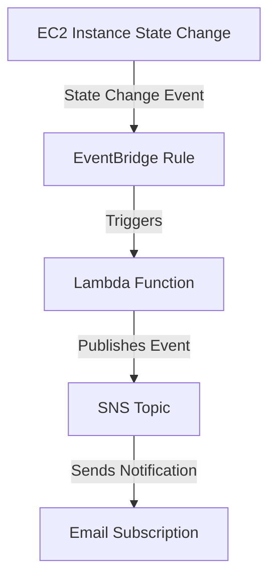

# Lambda EC2 State Change Notifier

A fully automated AWS CDK project that triggers a Lambda function on EC2 instance state changes (start/stop), logs event details, and publishes notifications to an SNS topic with email subscription.

---

## Table of Contents
- [Architecture](#architecture)
- [Features](#features)
- [Setup & Prerequisites](#setup--prerequisites)
- [Commands](#commands)
- [Configuration](#configuration)
- [How it Works](#how-it-works)
- [Sample Logs](#sample-logs)
- [Troubleshooting](#troubleshooting)
- [Project Structure](#project-structure)
- [License](#license)

---

## Architecture



---

## Features
- **Event-driven:** Reacts to EC2 instance state changes (start/stop)
- **Serverless:** Uses AWS Lambda for processing
- **Notification:** Publishes event details to an SNS topic
- **Email Alerts:** Sends email notifications via SNS subscription
- **Strong typing & error handling**
- **Easy to extend**

---

## Setup & Prerequisites

> **⚠️ Special Note:**
> 
> **Any code changes made in `src/index.ts` will only reflect in the deployed Lambda after you run:**
> ```bash
> npm run build
> ```
> This compiles TypeScript to JavaScript. Always build before deploying or updating your stack!

1. **Install Node.js (v18 or later recommended)**
2. **Install AWS CDK CLI:**
   ```bash
   npm install -g aws-cdk
   ```
3. **Configure AWS credentials:**
   ```bash
   aws configure
   ```
4. **Clone this repository:**
   ```bash
   git clone <your-repo-url>
   cd <project-directory>
   ```
5. **Install dependencies:**
   ```bash
   npm install
   ```
6. **Bootstrap your AWS environment (first time only):**
   ```bash
   cdk bootstrap
   ```

---

## Commands

- **Build TypeScript:**
  ```bash
  npm run build
  ```
- **Deploy the stack:**
  ```bash
  cdk deploy
  ```
- **Destroy the stack:**
  ```bash
  cdk destroy
  ```
- **Watch for changes (optional):**
  ```bash
  npm run watch
  ```

---

## Configuration

- **Email Subscription:**
  - Update the `EMAIL_ID` constant in `lib/lambda-sns-stack.ts` to your email address.
  - After deployment, check your email and confirm the SNS subscription.
- **Region:**
  - The stack deploys to your default AWS CLI region. Change with `AWS_REGION` env variable if needed.

---

## How it Works

1. **EventBridge Rule** listens for EC2 instance state change notifications.
2. **Lambda Function** is triggered, logs event details, and publishes the event to the SNS topic.
3. **SNS Topic** receives the message and sends an email notification to all confirmed subscribers.

---

## Sample Logs

Example Lambda logs in CloudWatch:

```
START RequestId: 1dfbc85a-5081-455e-aa00-51bcac366198 Version: $LATEST
2025-05-27T06:59:00.187Z	1dfbc85a-5081-455e-aa00-51bcac366198	INFO	Event: 
{
    "version": "0",
    "id": "edc859d4-ec22-9c86-16ad-4162f4f47f77",
    "detail-type": "EC2 Instance State-change Notification",
    "source": "aws.ec2",
    "account": "698926940450",
    "time": "2025-05-27T06:59:00Z",
    "region": "us-east-1",
    "resources": [
        "arn:aws:ec2:us-east-1:698926940450:instance/i-0403d6818c5016e11"
    ],
    "detail": {
        "instance-id": "i-0403d6818c5016e11",
        "state": "running"
    }
}
2025-05-27T06:59:00.187Z	1dfbc85a-5081-455e-aa00-51bcac366198	INFO	Instance ID: i-0403d6818c5016e11
2025-05-27T06:59:00.187Z	1dfbc85a-5081-455e-aa00-51bcac366198	INFO	State: running
2025-05-27T06:59:00.187Z	1dfbc85a-5081-455e-aa00-51bcac366198	INFO	Region: us-east-1
2025-05-27T06:59:00.187Z	1dfbc85a-5081-455e-aa00-51bcac366198	INFO	Account ID: 698926940450
2025-05-27T06:59:00.187Z	1dfbc85a-5081-455e-aa00-51bcac366198	INFO	Time: 2025-05-27T06:59:00Z
2025-05-27T06:59:00.188Z	1dfbc85a-5081-455e-aa00-51bcac366198	INFO	SNS_TOPIC_ARN: arn:aws:sns:us-east-1:698926940450:EC2StateChangeTopic
2025-05-27T06:59:00.188Z	1dfbc85a-5081-455e-aa00-51bcac366198	INFO	Topic ARN: arn:aws:sns:us-east-1:698926940450:EC2StateChangeTopic
END RequestId: 1dfbc85a-5081-455e-aa00-51bcac366198
```

---

## Troubleshooting

- **No logs in CloudWatch:**
  - Ensure Lambda has correct log permissions.
  - Make sure your TypeScript is compiled to JavaScript before deployment.
- **SNS NotFoundException:**
  - Ensure the Lambda uses the correct SNS topic ARN (from environment variable).
  - Use a fixed topic name if you want a predictable ARN.
- **Email not received:**
  - Confirm the SNS subscription in your email inbox.
- **Instance ID is undefined:**
  - Check the event structure in logs. Use `event.detail['instance-id']`.

---

## Project Structure

```
.
├── lib/
│   └── lambda-sns-stack.ts   # CDK stack definition
├── src/
│   └── index.ts              # Lambda handler (TypeScript)
├── package.json
├── tsconfig.json
├── README.md
└── ...
```

---

## License

MIT
